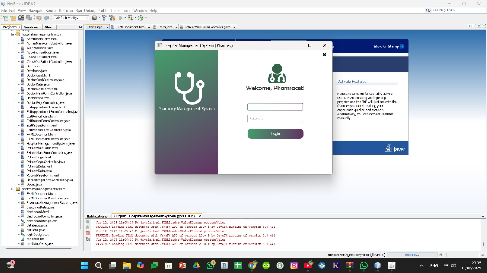

# MediStock
Ini adalah suatu bentuk penugasan akhir untuk mata kuliah Pemrograman Berorientasi Objek yang diampu oleh yang terhormat:
1. Dr. Bambang Sujatmiko, M.T.;
2. Rizky Basatha, S.Pd., M.MT., and
3. Sonhaji Akbar, S.Pd., M.Kom.

## Deskripsi Singkat
Aplikasi **MediStock** ini dirancang untuk membantu pengelolaan data rumah sakit secara efisien. Proyek ini menyederhanakan proses pendaftaran pasien, manajemen obat, dan penjadwalan dokter.

Tujuannya adalah untuk:
1. Meningkatkan efisiensi pengelolaan data rumah sakit.
2. Mempermudah akses informasi bagi staf medis.

## Screenshot

*Login Developer dan Select User*


*Dashboard Developer*


*Login Admin*


*Login Dokter*


*Login Apoteker*


*Login Pasien*

## Fitur Utama
1. Manajemen pasien dan dokter
2. Pencatatan obat dan stok
3. Sistem penjadwalan
4. Ekspor laporan
5. Antarmuka GUI berbasis JavaFX

## Cara Instalasi
1. Pastikan Java JRE telah terinstal di sistem Anda.
2. Ekstrak file `LaucherBuild.zip`.
3. Jalankan aplikasi menggunakan:
   - `Medistock.exe` (untuk Windows)
   - Atau jalankan file `HospitalManagementSystem.jar` secara manual:
     ```bash
     java -jar HospitalManagementSystem.jar
     ```

## Cara Penggunaan / Testing
1. Klik dua kali `Medistock.exe` untuk menjalankan aplikasi.
2. Login ke sistem menggunakan kredensial default (jika disediakan).
3. Navigasikan melalui menu untuk mengelola pasien, dokter, dan obat.

## Teknologi yang Digunakan
1. Bahasa Pemrograman: Java
2. GUI: JavaFX
3. Launcher: Launch4j
4. Charting Library: JFreeChart
5. File Pendukung Web: dtjava (Java Web Start)

## Kontributor
- Yusuf Ramadhan Morti Sondang Simanjuntak *'067*
- Fandi Prasetya *'078*
- Mikhael Yuli Ananda Elvan Permana *'086*

## Link Terkait
- [Dokumentasi JavaFX](https://openjfx.io/)
- [Launch4j](http://launch4j.sourceforge.net/)

## Lisensi
Proyek ini menggunakan lisensi **MIT**. Silakan disesuaikan jika menggunakan lisensi lain.

## Catatan Tambahan
1. **To-Do List:**
  - Tambahkan fitur notifikasi
  - Integrasi dengan sistem rekam medis digital

2. **Known Issues:**
  - Beberapa ikon tidak muncul di sistem operasi tertentu

3. **Roadmap:**
  - Dukungan multi-user dan login berbasis role
  - Peningkatan keamanan data
